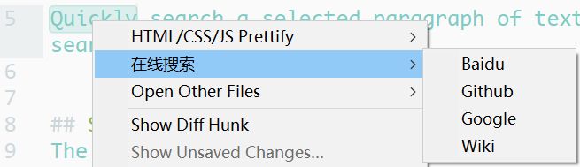

# Search Online

## Features
Quickly search a selected paragraph of text in the browser by configuring the search engine name and link.


## Installation
Before you install this plugin, you need to install my another plugin [dctxmenu](https://github.com/absop/dctxmenu)(**Dynamic Context Menu**). Because this plugin(**SearchOnline**) uses **dctxmenu** to generate menus dynamically.

### !! Note:
Please make sure that **dtcxmenu** is installed correctly in a subdirectory called **dtcxmenu** in your package directory. If you're using `git clone`, you won't have this problem, but if you're using a browser to download it, you'll need to change the folder name.

### Installation Steps
1. Copy the URL of this repository: <https://github.com/absop/SearchOnline>
2. Enter into Sublime Text, press down the shortcut <kbd>Ctrl+Shift+P</kbd> to enter into **Command Palette**
3. Input the command `pcar(Package Control: Add Repository)`
4. Press down the shortcut <kbd>Ctrl+V</kbd>, then <kbd>Enter</kbd>
5. Using **Package Control** to install this package
   1. Press down <kbd>Ctrl+Shift+P</kbd>
   2. Input `pcip(Package Control: Install Package)`
   3. Input `SearchOnline`


## Settings
The default settings are shown below
```json
{
    "caption": "Search Online",
    "platforms": {
        "Wiki": "https://en.wikipedia.org/wiki/%s",
        "Github": "https://github.com/search?q=%s&type=Code",
        "Baidu": "https://www.baidu.com/s?ie=UTF-8&wd=%s",
        "Google" : "http://google.com/#q=%s"
    }
}
```
when you select a paragraph of text, click the right mouse button, you can get the following menu


And if your setting is
```json
{
    "caption": "在线搜索",
    "platforms": {
        "Wiki": "https://en.wikipedia.org/wiki/%s",
        "Github": "https://github.com/search?q=%s&type=Code",
        "Baidu": "https://www.baidu.com/s?ie=UTF-8&wd=%s",
        "Google" : "http://google.com/#q=%s"
    }
}
```
then you will get the follow menu when you select a paragraph of text and click the right mouse button.

